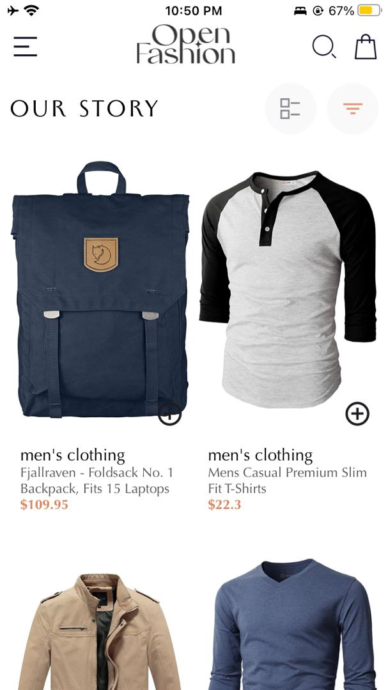
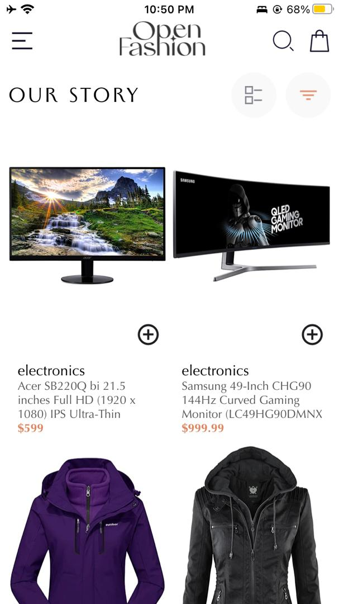
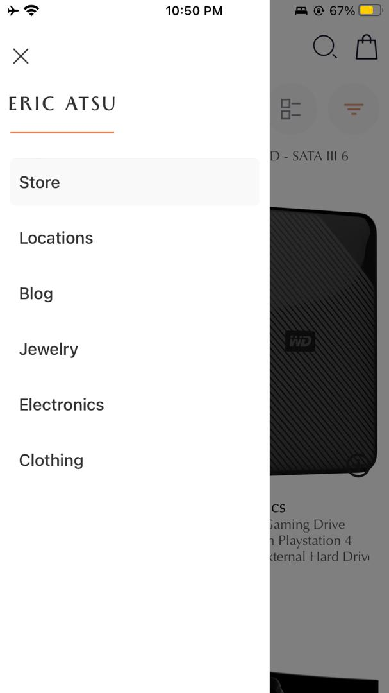
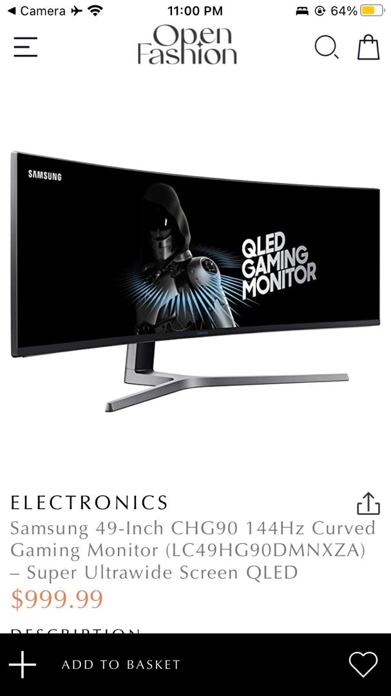
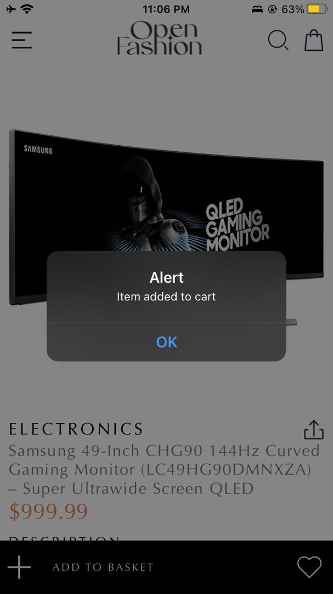
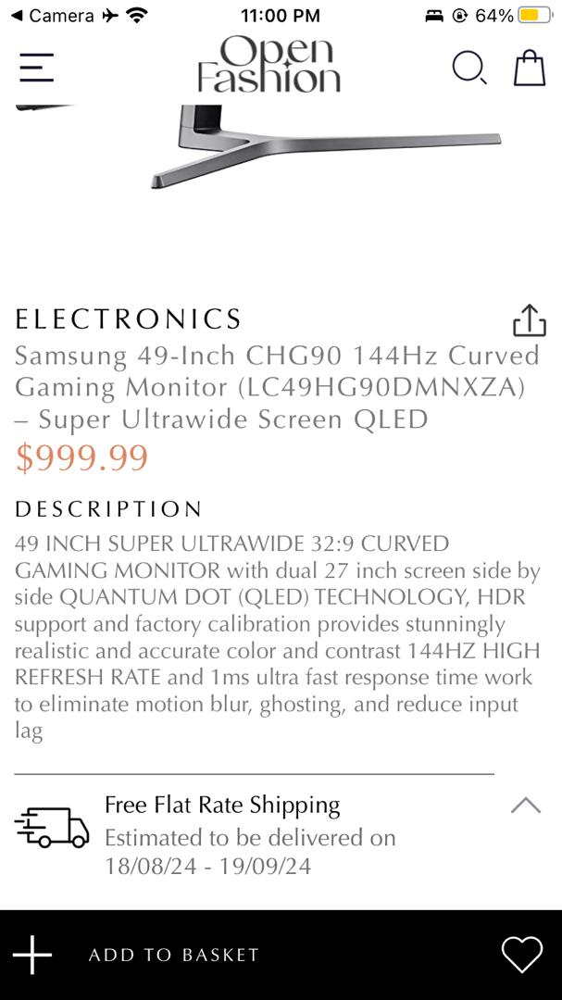
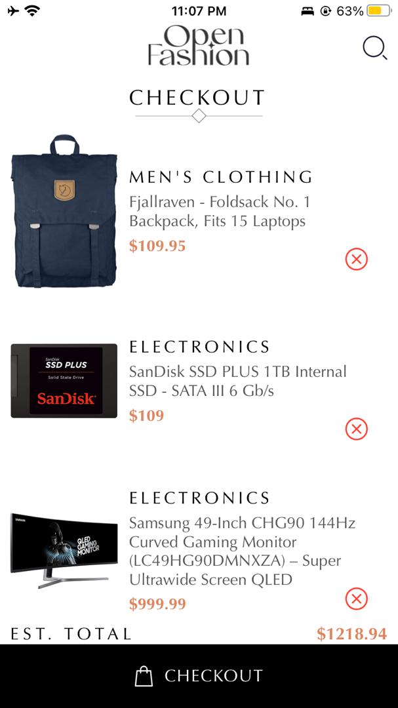

# React Native Shopping Application
## Student ID: 11014111
### Project Overview
This is a React Native application created using Expo CLI. It was created for my sixth assignment in Mobile Application Development. 

### What is this app?
The app is an online shopping application that fetches products from an external API

### App Functionality
- **Browse Products**: Users can view available products in the store screen.
- **External API Usage**: Products on display are fetched from an external API.
- **View Product Details**: Users can see more details about a product when they click on it.
- **Add to Cart**: Items can be added to the cart from the store screen and the product details screen.
- **View Cart**: Users can see the list of items added to their cart on the Cart screen.
- **Remove from Cart**: Items can be removed individually from the cart.
- **Custom Navigation Drawer**: Users can swipe or click the menu icon to access the navigation drawer.
- **Calculate Total**: The app calculates and displays the total price of items in the cart.
- **Local Storage**: AsyncStorage is used to store users' cart items locally on their device.

### Project Structure
- [`app-screenshots`](./app-screenshots/): Contains screenshots of the application
- [`assets`](./assets/): Contains images and other assets used in the application, such as icons and images of products
- [`components`](./components/): Contains all reusable components used across different parts of the application. Each component is organized in a relevant subfolder.
- [`contexts`](./contexts/): Contains all contexts used in the application. In this application, there is only the cart context.
- [`local-storage`](./local-storage/): Contains localStorage.js, which sets up functions for storage management using AsyncStorage
- [`navigation`](./navigation/): Contains index.js, which sets up navigation using a drawer 
- [`screens`](./screens/): Contains the main screens (Home and Cart)
- [`styles`](./styles/): Contains styling files for the components and screens. All styles are organized in relevant subfolders.
- [`App.js`](./App.js): Main entry point of the app. It sets up the drawer component for navigating between screens.
- [`app.json`](./app.json): Configuration file for the Expo project, defining project settings and metadata
- [`babel.config.js`](./babel.config.js): Babel configuration file, used to specify how JavaScript code is compiled
- [`package-lock.json`](./package-lock.json): Automatically generated file that describes the exact tree of dependencies that were installed for the project
- [`package.json`](./package.json): Contains metadata about the project, including dependencies, scripts, and project info
- [`README.md`](./README.md): This README file, providing an overview and documentation for the project

### Design Choices
The app was created using the design found here.

### Data Storage Implementation
In this application, the products being displayed are fetched from an external API. AsyncStorage is used to store and retrieve cart items and the total amount locally on the device. 
- **Fetching products**: Items are fetched from an external API instead of hardcoded data using Axios.
- **Storing Items**: When an item is added to the cart, the current cart items and total amount are stored in AsyncStorage.
- **Retrieving Items**: When the app is loaded, the stored cart items and total amount are retrieved from AsyncStorage and set in the state.
- **Functions**: The functions `storeItem`, `getItem`, and `removeItem`, which I created in [`localStorage.js`](./local-storage/localStorage.js) are used to interact with AsyncStorage.

### Technology Stack Used
- React Native
- Expo CLI
- Other dependencies found in the [`package.json`](./package.json) file
- External API

### Clone This Repository
- Open your terminal and navigate to the folder you want this repository to be cloned.
- Paste the following command
```
git clone https://github.com/favourrr-a/rn-assignment7-11014111.git
```
- Navigate to the project directory
```
cd rn-assignment7-11014111
```

### Test This App
#### Prerequisites
- Have Node.js installed

#### Steps
- First clone the repository using the steps above
- Make sure to navigate to the project directory
- Install expo
```
npm install expo
```
- Install dependencies found in the [`package.json`](./package.json) file
- Run the application
```
npx expo start
```
- Follow the steps that show up after entering the above command

### Screenshots Of The Application






